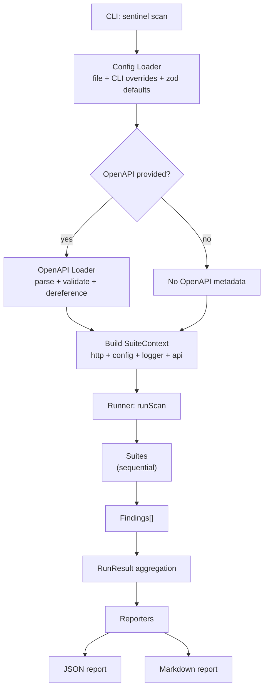

# Sentinel Architecture

Sentinel is a CLI-based API security scanner. It runs a set of passive and controlled active checks against an HTTP API and produces JSON + Markdown reports suitable for local use and CI.

This document explains how Sentinel is structured, how data flows through the system, and where responsibilities live.



---

## Goals

- **Modular**: suites are pluggable and isolated.
- **Typed + validated**: config and core data models are strongly typed and validated at runtime.
- **Deterministic + testable**: suites consume a narrow context and return structured findings; I/O is centralized.
- **Safe by default**: active checks are bounded; injection/fuzzing is opt-in.
- **CI friendly**: stable exit codes and machine-readable output.

Non-goals (at least initially):

- A full web scanner or crawler
- Exploit frameworks or destructive testing
- Heavy concurrency/retry logic in the core execution path

---

## High-level data flow

```
sentinel scan (CLI)
  └─ loadConfig (file + CLI overrides + schema defaults)
      └─ optional loadOpenApi (file or URL)
          └─ build runtime context (http + logger + config + api?)
              └─ runScan
                  ├─ run suites sequentially → Finding[]
                  ├─ aggregate RunResult
                  └─ run reporters → files on disk
```

---

## Repository layout

```
src/
  cli/
    index.ts
    commands/
      scan.ts
  config/
    schema.ts
    load.ts
  core/
    types.ts
    logger.ts
    runner.ts
  http/
    client.ts
  openapi/
    load.ts
    types.ts
  reporters/
    json.ts
    markdown.ts
  suites/
    index.ts
    headers.ts
    cors.ts
    auth.ts
    ratelimit.ts
    inventory.ts
    injection.ts

examples/

test/
  ...
```

---

## Core concepts

### Config

Config is loaded from schema defaults, an optional config file, and CLI flags (highest precedence).  
Sensitive values are sanitized before being written to reports.

---

### SuiteContext

Suites receive a narrow execution context:

- `http`
- `config`
- `logger`
- `selectedEndpoints` — pre-filtered endpoint list derived from the OpenAPI spec and scope config; resolved once at scan time
- optional `api` metadata from OpenAPI

Suites should not access the filesystem or parse configuration directly.

---

### Suites

Suites encapsulate one category of security checks and return structured findings.  
They should be stateless, isolated, and conservative in their claims.

---

### Findings

Findings are structured security observations with:

- stable IDs
- severity
- description and "why it matters" explanation
- OWASP category tag
- optional remediation guidance
- optional evidence

They are designed to be both machine-readable and human-readable.

---

### HTTP Client

The HTTP client is a thin wrapper around `fetch` that:

- resolves URLs
- injects auth and headers
- enforces timeouts
- normalizes responses

Retries and concurrency control are intentionally out of scope.

---

### OpenAPI Integration

OpenAPI support is optional.  
When provided, Sentinel loads, validates, dereferences, and extracts endpoint metadata which suites may optionally consume.

---

### Runner

The runner orchestrates suite execution, aggregates findings, and dispatches reporters.  
It does not interpret or suppress findings.

---

### Reporters

Reporters transform a `RunResult` into output formats such as JSON or Markdown.  
They do not execute scans or perform network requests.

---

## Auth tiers (Tier-0/1/2)

Sentinel scans in one of three tiers, determined entirely by how many entries
are in `auth.identities` — there is no separate flag to opt into a tier.

| Tier | Trigger                            | Adds                                                                                                                        |
| ---- | ------------------------------------ | ------------------------------------------------------------------------------------------------------------------------------ |
| 0    | No `auth.identities` configured      | Passive black-box surface scanning — headers, CORS, inventory, JWT shape, injection surface                                  |
| 1    | One identity configured              | Authenticated scanning — definitive JWT/token enforcement probing (`auth.invalid_token_accepted`), mass assignment (`auth.mass_assignment_accepted`, opt-in via `auth.massAssignmentProbe`) |
| 2    | Two or more identities configured    | Multi-identity testing — cross-identity BOLA detection (`auth.bola_object_access`)                                            |

Tiers are additive: Tier-2 still runs every Tier-0 and Tier-1 check. See
[`FINDINGS.md`](../FINDINGS.md) for the full per-check registry, including
which finding IDs require which tier. Function-level authorization (BFLA) has
no dedicated check at any tier yet.

This vocabulary is used consistently by downstream repos — Weir's
`docs/ARCHITECTURE.md` documents which tier it runs Sentinel at.

---

## Safety model

Sentinel is designed to be safe-by-default:

- bounded active checks
- no automatic redirect following
- no destructive requests unless explicitly enabled

Use Sentinel only against systems you are authorized to test.

---

## Testing strategy

- deterministic suite tests with mocked HTTP
- runner integration tests
- CLI smoke tests without spawning processes

---

## Extension points

- Add suites under `src/suites/`
- Add reporters under `src/reporters/`
- Use OpenAPI endpoints via `ctx.api` when available
